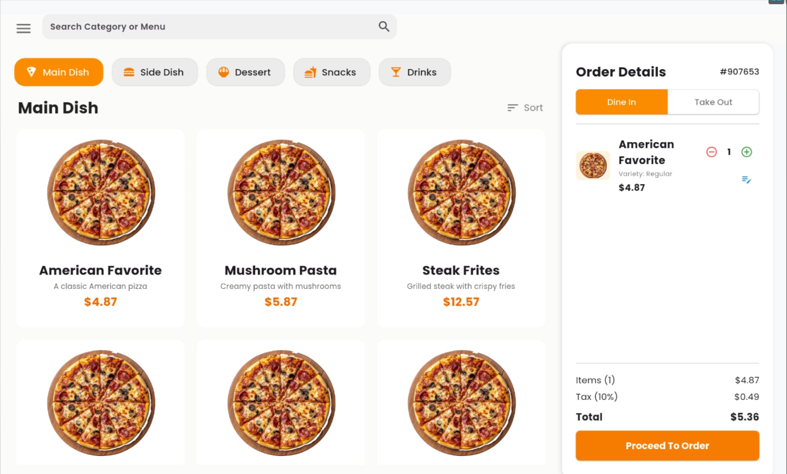
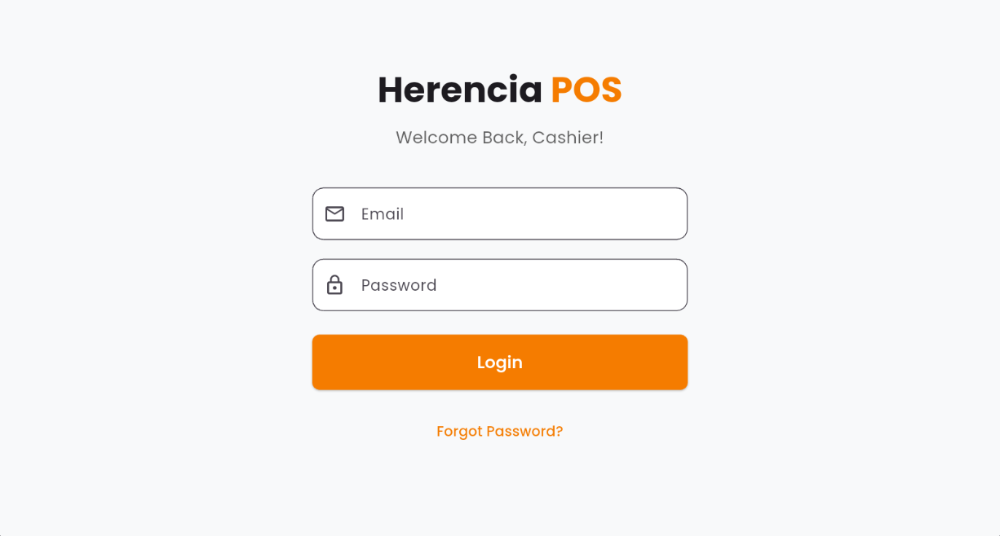
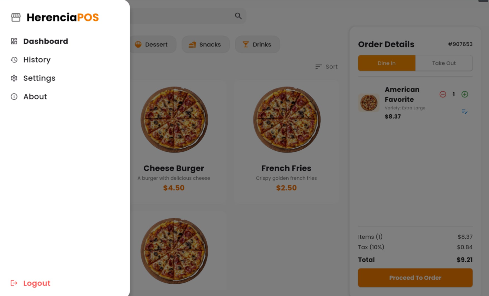
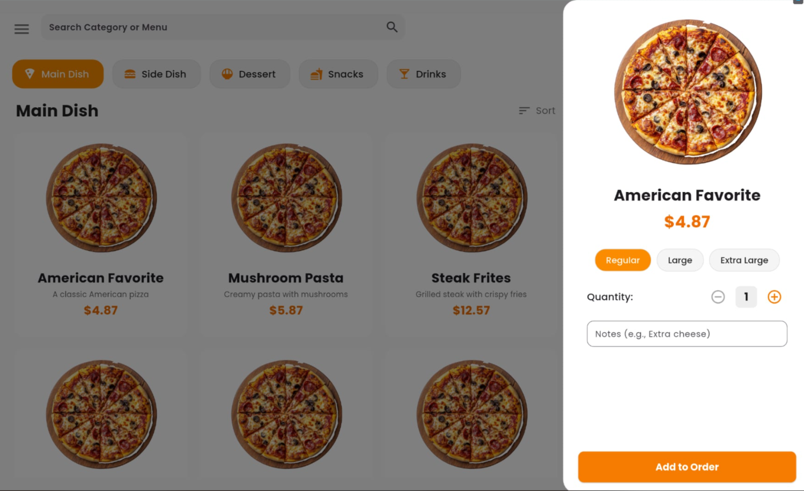

<div align="center">

# La Herencia POS

### *Fast, Modern Point of Sale System Built with Flutter*

<p>
   <a href="https://github.com/danielnoelle/HerenciaPOS">
      
   </a>
   <a href="LICENSE">
      
   </a>
   <a href="https://www.instagram.com/_noweliih/">
      
   </a>
</p>



</div>

---

## ✨ Features

<table>
<tr>
<td width="50%">

**🎯 Unified POS Toolkit**  
Complete sales processing, menu management, order history, and cashier tracking in one comprehensive application

**🔐 Secure Authentication**  
Firebase-powered staff login with robust session management and time-in/time-out tracking

</td>
<td width="50%">

**☁️ Real-Time Cloud Sync**  
Seamless data synchronization with Firebase Firestore and offline-first SQLite storage

**🎨 Modern Cross-Platform UI**  
Clean, intuitive Flutter interface designed for efficiency across Android, iOS, Web, and Desktop

</td>
</tr>
</table>

---

## 🚀 Quick Start

**Prerequisites**

```bash
# Ensure Flutter SDK is installed (version 3.7.2 or higher)
flutter --version
```

**Clone and Setup**

```bash
git clone https://github.com/danielnoelle/HerenciaPOS.git
cd HerenciaPOS
flutter pub get
```

**Run Application**

```bash
flutter run
```

---

## 💡 Configuration Tips

| Feature | Description |
|---------|-------------|
| **🔥 Firebase** | Configure your Firebase settings in `lib/config/firebase_options.dart` before first run |
| **🗄️ Local Database** | SQLite database is automatically managed via `database_helper.dart` |
| **👥 Cashier Management** | Manage cashier accounts through Firebase Firestore console |
| **🔄 Sync Settings** | Automatic sync runs every 15 minutes; manual sync available in-app |
| **📱 Multi-Platform** | Supports Android, iOS, Web, Windows, macOS, and Linux |
| **🐛 Debug** | Run `flutter run -v` from terminal for verbose debug output |

---

## 📋 Core Capabilities

### Fast Sales Processing

Process transactions in seconds with intuitive menu navigation, automatic calculations, and instant order tracking.

```
✓ Quick item selection with visual menu
✓ Variety/size selection support
✓ Custom notes for special orders
✓ Instant order processing & receipts
```

### Smart Menu Management

Maintain complete control over your menu with real-time Firebase sync and category filtering.

```
✓ Add/Edit/Remove menu items
✓ Category-based filtering
✓ Price varieties (sizes/options)
✓ Real-time sync from cloud
```

### Order History & Analytics

Track all transactions with detailed history and comprehensive order breakdowns.

```
✓ Complete transaction history
✓ Detailed order breakdown
✓ Date-based filtering
✓ Transaction search functionality
```

### Cashier & Session Management

Secure your business with Firebase authentication and comprehensive time logging.

```
✓ Secure login/logout system
✓ Time-in/Time-out tracking
✓ Cashier activity logging
✓ Session management & auditing
```

---

## 🖼️ Screenshots

<div align="center">
<table>
<tr>
<td width="50%">

<p align="center"><em>Secure Login Interface</em></p>
</td>
<td width="50%">

<p align="center"><em>POS Order Dashboard</em></p>
</td>
</tr>
<tr>
<td width="50%">

<p align="center"><em>Left Bar</em></p>
</td>
<td width="50%">

<p align="center"><em>Right Bar</em></p>
</td>
</tr>
</table>
</div>

<br>

## 🛠️ Technology Stack

- **Framework:** Flutter 3.7.2+ (Dart)
- **Backend:** Firebase (Auth, Firestore)
- **Local Database:** SQLite (sqflite)
- **State Management:** Built-in Flutter State
- **Connectivity:** connectivity_plus
- **Receipt Printing:** flutter_esc_pos_utils
- **Architecture:** Service-based Pattern
- **Typography:** Poppins Font Family

## 📋 System Requirements

| Requirement | Details |
|-------------|---------|
| **OS** | Android 5.0+, iOS 12+, Windows 10+, macOS 10.14+, Linux |
| **Flutter** | 3.7.2 or higher |
| **RAM** | 2GB minimum (4GB recommended) |
| **Storage** | 200MB for application |
| **Network** | Internet required for Firebase sync (offline mode available) |

## 📁 Project Structure

```
lib/
├── config/          # Firebase and app configuration
├── helpers/         # Database helper utilities
├── models/          # Data models (Menu, Sale, Cashier, TimeLog)
├── screens/         # UI screens (POS, Login, History, etc.)
├── services/        # Business logic (Auth, Sync services)
└── main.dart        # Application entry point
```

## 📝 License

This project is licensed under the **MIT License** — feel free to use, modify, and contribute.  
See [LICENSE](LICENSE) for full details.

---

<div align="center">

**Built with ❤️ by [danii](https://github.com/danielnoelle)**

⭐ Star this repository if you find it helpful!

</div>
